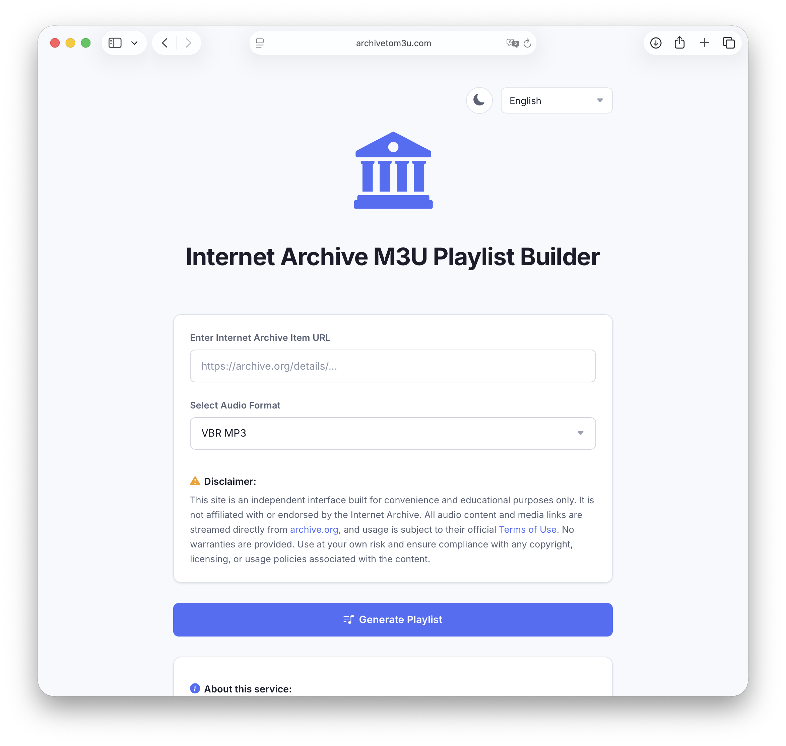

# 🎵 Internet Archive M3U Playlist Generator

Create and export `.m3u` playlists directly from Internet Archive items — including **Live Music Archive** recordings — and stream them in your favorite player (like [Flacbox](https://apps.apple.com/app/apple-store/id1097564256) or [Evermusic](https://apps.apple.com/app/id885367198)).

🔗 **Live demo**: [archivetom3u.com](https://archivetom3u.com)

## 🚀 Features

- 🎧 Streamable `.m3u` playlists from **archive.org** items  
- 🔍 Preview audio files inline using a built-in HTML5 player  
- 🔽 Download the generated `.m3u` file instantly  
- 🛡 100% client-side — **no backend, no tracking, no uploads**  
- 💚 Open-source and GitHub-editable  

---

## 📦 Supported Audio Formats

Only tracks matching your selected format will be included:

- VBR MP3
- FLAC
- 24-bit FLAC
- OGG VORBIS

---

## 🛠 How It Works

This tool fetches public metadata for any [Internet Archive](https://archive.org) item using its identifier (e.g. `/details/xxxxx`) via their metadata API.

It:
1. Filters audio files based on your chosen format  
2. Generates a valid `.m3u` playlist  
3. Lets you preview tracks instantly — **no account or installation required**

---

## 🧑‍💻 Contributing

Contributions are welcome! Please:

- Submit pull requests with meaningful descriptions  
- Open issues for feature suggestions or bug reports  
- Keep the tool lightweight and browser-friendly

👉 Edit the tool directly on GitHub:  
[Edit this page](https://github.com/everappz/archivetom3u/edit/main/index.html)

---

## 🛑 Disclaimer

This is an independent utility and is **not affiliated** with or endorsed by the Internet Archive.

All content is streamed from `archive.org` and usage is subject to their [Terms of Use](https://archive.org/about/terms.php). Use responsibly.

---

## 📄 License

MIT © [EVERAPPZ SL](https://www.everappz.com)

---

## 🙌 Built by [EVERAPPZ](https://www.everappz.com)
